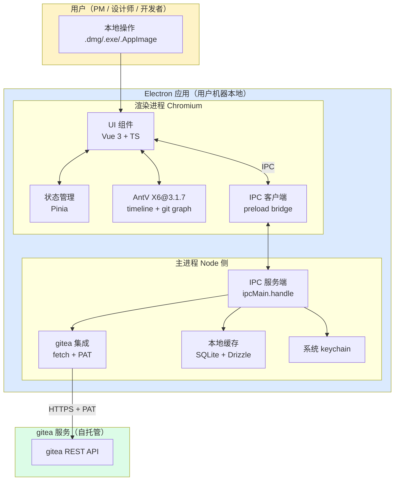

# 设计综述 + 路线图：gitea-kanban

> **本文档是用户 review 的入口**。读完本文档能 5 分钟内掌握 gitea-kanban 的产品定位、
> 技术选型、关键决策、UI 草案、M0~M3 路线图。要深入任何一节，点对应链接到 `01~03` 设计文档。
>
> 设计阶段产物时间：2026-06-10
> **v5 增量（2026-06-10 17:24）**：渲染进程框架 React 18 → **Vue 3**（用户拍板；理由：团队无 React 积累，Vue 3 在团队内有现成积累）。配套：Zustand → Pinia / Radix UI → Radix Vue / React Router 6 → Vue Router 4 / 新增 `@antv/x6-vue-shape` 桥接包。
> 依赖文档：[01-research.md](./01-research.md) · [02-architecture.md](./02-architecture.md) · [03-frontend.md](./03-frontend.md)

---

## 1. 一句话定位

> **gitea-kanban = 给 gitea 用户的桌面端看板 + 时间轴工具，专注强 git 集成 + 零术语界面 + 单二进制轻量自托管。**

---

## 2. 核心特性清单

1. **多分支提交时间轴**：在 X6 图编辑引擎上渲染多分支 commit 节点 + PR 合并边，可缩放 / 平移 / lane 过滤；commit hover 看完整信息、点击看关联卡片、双击跳 gitea。
2. **git 增强看板**：Trello 式列拖拽看板，但**卡片可关联 commit / PR / branch**；合并某 PR 后卡片可一键从"待合并"列移到"已合并"列。
3. **分支管理**：列表 + 创建 / 删除 / 收藏（重命名 / 保护规则 v2 再做，gitea 暂无完整 rename API）。
4. **合并管理**：PR 列表 + 在桌面内合并（普通 / 变基 / 压缩三种方式，每种 hover 显示解释）；冲突检测 + 跳 gitea 网页处理。
5. **本地优先、远程兜底、断网只读**：网络断开时不崩，按 stale 缓存继续显示 + 状态栏提示"离线模式"。
6. **零术语 + 危险操作二次确认**：UI 永远说"合并请求 / 合并 / 变基"等人话；删分支 / 合并到 main / 压缩合并全部二次确认。
7. **单二进制 + 跨平台**：macOS dmg（v1 优先）/ Windows exe / Linux AppImage；自托管团队拷一个文件就能用。
8. **多账号支持**：在多个 gitea 实例间切换；PAT 存系统 keychain（macOS Keychain / Windows Credential / Linux Secret Service）。

---

## 3. 架构简图

> 完整图见 [02-architecture.md §1](./02-architecture.md)。下图是转述版。



**关键边界**：
- **token 不离开主进程**——`auth.connect` 是唯一接收入口，之后所有 gitea 调用主进程内部完成
- **git 数据不持久化**——commit / PR / branch 内容用时现拉 gitea，本地只存"上次切片缓存"
- **本地数据**：用户偏好 / 看板列 / 卡片 / 关联 / 缓存元数据 / 撤销栈 → SQLite

---

## 4. 关键决策摘要

> 来自 [01-research.md](./01-research.md) / [02-architecture.md](./02-architecture.md) / [03-frontend.md](./03-frontend.md) 的提炼。每条只给**结论 + 理由一句话 + 指向详细文档的链接**。

| # | 决策 | 结论 | 理由（一句） | 详细 |
|---|------|------|------------|------|
| 1 | **技术栈** | Electron + TypeScript 桌面应用 | 单二进制、跨平台、与本地资源零摩擦；桌面应用无 OAuth 跳转必要 | [02 §2](./02-architecture.md#2-技术栈定型), [01 §5](./01-research.md#5-技术决策候选) |
| 2 | **鉴权** | gitea Personal Access Token + 系统 keychain | 桌面应用单机单用户，OAuth 跳转 + CSRF 是负担；keychain 是 macOS/Win/Linux 通用的安全 token 落盘 | [02 §2.6 / §6.1](./02-architecture.md#26-鉴权gitea-pat--系统-keychain) |
| 3 | **后端 / 数据** | 主进程 + SQLite（better-sqlite3 + Drizzle ORM） | 单进程无需 HTTP；Drizzle schema-first 与 TS 类型双向同步 | [02 §2.3 / §2.4 / §4](./02-architecture.md#23-主进程本地服务层) |
| 4 | **前端框架** | **Vue 3 + Vite + Pinia + CSS Modules**（2026-06-10 17:24 用户拍板；理由：团队无 React 积累，Vue 3 在团队内有现成积累） | X6 通过 `@antv/x6-vue-shape` 官方桥接；Pinia setup store 与 Composition API 同源；CSS 变量易切暗色 | [02 §2.2 + §2.2.1](./02-architecture.md#22-渲染进程ui-层), [03 §6 / §7 / §5.6](./03-frontend.md) |
| 5 | **timeline 库** | AntV X6@3.1.7 | 图编辑引擎，git graph 的 DAG（commit 节点 + 父子边 + 合并边）是其甜区；用户已熟悉栈 | [01 §4](./01-research.md#4-timeline-方案对比), [03 §5](./03-frontend.md#5-时间轴可视化方案重点) |
| 6 | **IPC 契约** | Zod schema → TS 类型自动派生到 `src/shared/ipc-types.ts` | 前后端编译时共用，字段不匹配编译报错 | [02 §5.1 / §8.2](./02-architecture.md#51-ipc-通道约定) |
| 7 | **缓存策略** | cache-aside + 写穿失效 + 离线降级 stale | 远程失败不崩，按 stale 缓存继续显示 + 状态栏提示 | [02 §6.3](./02-architecture.md#63-缓存策略本地优先远程兜底断网只读) |
| 8 | **设计原则** | 零术语 + 二次确认 + 错误人话 + a11y 加强 + **v1 单主题暗色（不提供切换）** | 目标用户含非技术人员（PM / 设计师 / 运营）；主题策略由用户 2026-06-10 12:12 拍板 | [02 §2.7](./02-architecture.md#27-设计原则必须显式遵守), `design-system/gitea-kanban/OVERRIDE.md` |
| 9 | **设计系统** | gitea 绿 `#609926` 主色 + 橙 `#f76707` 强调 + 浅色默认 + 暗色可切 | 贴 gitea 生态保持一致；非技术用户要"看得懂"，大色块 / 暗色默认不专业 | `design-system/gitea-kanban/OVERRIDE.md` |
| 10 | **打包** | electron-builder，macOS dmg v1 优先 / Windows exe / Linux AppImage | 跨平台单二进制；macOS 用户群在 gitea 生态最活跃 | [02 §2.5](./02-architecture.md#25-部署形态) |
| 11 | **v1 不做** | 实时协作 / in-app 冲突解决 / OAuth 跳转 / webhook server（v2 开） / git CLI（v2 高级场景） | 范围收敛；桌面应用无 OAuth 必要；in-app 冲突是 GitLens 级别工作量 | [02 §2.6 + §6.4 + §7.1](./02-architecture.md) |
| 12 | **v1 不绑死** | API 层抽象成 git provider interface，v2 支持 GitLab / Forgejo | v1 只实现 gitea，但留扩展口子 | [01 §3.不要做 #3](./01-research.md#要做-与不要做边界建议) |

---

## 5. 截图区（静态 wireframe）

> 三份 wireframe 是**纯 HTML + 内联 CSS**，无 build step。用浏览器打开可看效果。
> 颜色 / 间距 / 字号已在 03-frontend.md §7 与 OVERRIDE.md 定型；本节展示**真实视觉效果**。

### 5.1 看板主页（侧栏 + 看板列 + 卡片 + 抽屉）

[`docs/design/wireframe/index.html`](./wireframe/index.html) — 主窗口布局壳：左侧导航 + 顶栏 + 主区"看板"tab，右侧滑出卡片详情抽屉。

**关键展示点**：
- 浅色默认主题（顶部有切换按钮可切到暗色）
- 4 列默认布局：待开始 / 进行中 / 待合并 / 已合并
- 卡片含关联 commit 数徽章
- 抽屉显示完整卡片信息 + 关联 commit 列表

### 5.2 时间轴视图（多泳道 + commit 节点 + 边 + zoom bar）

[`docs/design/wireframe/timeline.html`](./wireframe/timeline.html) — **核心视图**：X6 渲染的多分支 DAG。

**关键展示点**：
- 多泳道（按分支）：main / develop / feature-x / hotfix
- commit 节点：圆点（普通）+ 菱形（merge）
- 合并边用橙色加粗
- 底部 zoom bar 显示缩放级别
- lane 过滤侧栏

### 5.3 合并管理页（PR 列表 + 合并确认弹窗 mock）

[`docs/design/wireframe/merge.html`](./wireframe/merge.html) — PR 列表 + 合并操作。

**关键展示点**：
- PR 状态徽章（待合并 / 审核中 / 有冲突 / 已合并 / 已关闭）配图标 + 文字
- 合并确认弹窗含三种合并方式（普通 / 变基 / 压缩），每个 hover 显示解释
- 冲突时按钮禁用 + 跳 gitea 提示

> ⚠️ **这些是设计草案，不是真实 React/Electron 代码**——表达的是布局、视觉密度、交互位置。最终实现可能微调。

---

## 6. 里程碑 / 路线图

> 总节奏：**v1 半年内（M0~M2 必交付，M3 视情况）**。
> 每段列：目标 / 关键交付 / 依赖 / 风险。

### M0：基础设施（预计 2-3 周）

| 项 | 内容 |
|---|---|
| **目标** | 仓库初始化、CI 跑通、桌面应用能起空壳 |
| **关键交付** | ① `pnpm dev` 起 electron-vite 跑通<br>② `pnpm build` + `pnpm dist` 出 macOS dmg<br>③ Drizzle migration 跑通（空库）<br>④ CI 跑 lint + type-check + 单测<br>⑤ husky + lint-staged 提交前钩子<br>⑥ 仓库结构按 AGENTS.md §3 落地 |
| **依赖** | 无（开局） |
| **风险** | electron-builder 首次打包在 macOS arm64 上有签名 / notarization 配置踩坑；用 fork 模式先打通，签名 v1 不强制 |
| **对应 plan 子任务** | 02-architecture.md §8.5 的 #1（项目脚手架）+ #2（主进程骨架） |

### M1：核心读视图（预计 4-6 周）

| 项 | 内容 |
|---|---|
| **目标** | 用户能连接 gitea、看仓库 / 分支 / commit 列表、时间轴可视化、看板只读 |
| **关键交付** | ① `auth.connect` / `auth.status` 跑通（PAT + keychain）<br>② 仓库列表 + 选择当前仓库<br>③ 分支列表 + 收藏<br>④ commit 列表 + 单 commit 详情<br>⑤ PR 列表 + 单 PR 详情（**只读**）<br>⑥ 看板只读视图（列 + 卡片，不拖拽）<br>⑦ X6 时间轴可缩放 / 平移 / lane 过滤<br>⑧ 离线降级（断网 → stale 缓存 + 状态栏） |
| **依赖** | M0 完成 |
| **风险** | X6 在 Electron 渲染进程的 SVG 性能（千级节点）；先用 200 节点 demo 验证，再压 500；D3 fallback 留为 v2 预案 |
| **对应 plan 子任务** | 02-architecture.md §8.5 的 #3（鉴权 + gitea client）+ #4（数据模型 + migration）+ #5（仓库 / 分支 / commit / pulls IPC read 部分）+ #8（渲染进程脚手架）+ #9（仓库 / 分支 / PR 列表 UI 只读）+ #11（X6 timeline 视图） |

### M2：写操作（预计 4-6 周）

| 项 | 内容 |
|---|---|
| **目标** | 用户能在桌面内完成看板拖拽 + 分支写操作 + PR 合并 |
| **关键交付** | ① 看板拖拽（卡片跨列、撤销栈）<br>② 卡片 CRUD + 关联 commit/PR<br>③ 列 CRUD（创建 / 重命名 / 排序 / 删除带二次确认）<br>④ 分支创建 / 删除（**二次确认**）<br>⑤ 收藏分支<br>⑥ 创建 PR（卡片"提升"为 PR / 提交时直接跳 gitea）<br>⑦ 合并 PR（普通 / 变基 / 压缩，**二次确认**）<br>⑧ 关闭 PR（**二次确认**）<br>⑨ 权限校验（写操作前实时查 gitea 权限）<br>⑩ 系统通知（合并 / 关闭 / 被 mention） |
| **依赖** | M1 完成 |
| **风险** | 二次确认文案覆盖完整性（要逐项 review 02 §7.3 清单）；权限校验在弱网下的延迟体验（按钮先 disable，写时再校验） |
| **对应 plan 子任务** | 02-architecture.md §8.5 的 #6（看板 / 卡片 / 关联 IPC handler）+ #7（危险操作守卫）+ #10（看板拖拽 + 卡片 CRUD UI）+ #12（零术语 / 二次确认 / 错误人话） |

### M3：高级功能（预计 4-6 周，按需排期）

| 项 | 内容 |
|---|---|
| **目标** | 性能优化 + 多用户 + 可选 webhook server + 移动端 |
| **关键交付（候选）** | ① **本地 webhook server**（v2 才提供，设置页勾选后用 `127.0.0.1:<随机端口>` 收 gitea 推送，关闭时降级为轮询）<br>② **多用户 / 多 gitea 实例** SSO 切换（v1 已支持多账号，v3 完善 UI）<br>③ **缓存与性能优化**：X6 virtualRender 启用、IPC 往返 10ms 目标、commit 时间轴 2000 节点 ≤ 4s<br>④ **移动端适配**：单列竖向 commit 列表 + 折叠分支（timeline 在 < 768px 隐藏并提示"请在桌面端打开"）<br>⑤ **Sentry 接入**（用户填 DSN 才上报）<br>⑥ **e2e 测试完整化** + 视觉回归 baseline<br>⑦ **跨设备迁移**（导出 kanban.db + 偏好的 zip）<br>⑧ **CI 跨平台打包**（Windows / Linux runner）<br>⑨ **代码签名**（Windows Authenticode + Linux GPG） |
| **依赖** | M2 完成 + 至少 1 个内测用户反馈 |
| **风险** | webhook server 在用户机器上绑端口被防火墙挡；Electron 移动端不可能（v3 只做"窗口缩小降级"，不做 mobile app） |
| **对应 plan 子任务** | 02-architecture.md §8.5 的 #13（通知 + 设置 + 偏好页）+ #14（e2e + 打包脚本）+ #15（文档）—— 以及 #2-#12 的"加固" |

---

## 7. 下一步动作

> **重要**：本设计文档集（00 / 01 / 02 / 03 + wireframe + design-system）**只是设计阶段的交付**。
> **不会**自动启动实现 plan。

**等用户 review 通过本设计文档集后**，由用户**明确说"开始动手"** 才会：
1. orchestrator（mavis）按 `02-architecture.md` §8.5 的 15 个子任务拆 `mavis team plan`
2. 启动 mavis team plan，按 M0 → M1 → M2 顺序推进
3. 每个阶段交付按 AGENTS.md §4 的 commit 规范，由 orchestrator 统一打 commit

**用户可以怎么 review**：
- 直接对任何一节提修改意见（"零术语翻译表里 X 改成 Y"、"M2 风险评估不完整"）
- 在 `[02-architecture.md §8.5](./02-architecture.md#85-mavis-team-实现-plan-的建议拆分)` 的 15 个子任务上调整优先级
- 在 [本文件 §6 路线图](#6-里程碑--路线图) 上调整 M0~M3 的边界

**用户没明确说"开始动手"之前**：不要起新 agent、不要写代码、不要动设计文档。

---

## 附录：用户决策索引

> 本设计阶段共有 6 条**用户决策**对未来 mavis-team 实现 plan 有方向性影响。
> 实现 plan 改任何方向前必须先看这里。

| # | 时间 | 决策 | 影响范围 |
|---|------|------|----------|
| 1 | 2026-06-10 | **技术栈定型为 Electron + TypeScript 桌面应用**（不再是 Web + Go 后端 + SQLite + nginx 反代） | 架构 §1 架构图、§2 技术栈、§3 模块、§5 API 改为 IPC、§6 鉴权、§7 工作流、§8 agent 边界、§9 安全 |
| 2 | 2026-06-10 | **目标用户含非技术人员**（PM、设计师、市场、运营）—— UI 必须零术语、危险操作二次确认、错误提示"人话" | 架构 §2.7 设计原则、§7 危险操作流程、§9 错误处理；前端 03 §1 设计原则、§8.4 错误处理；设计系统 OVERRIDE |
| 3 | 2026-06-10 | **鉴权用 gitea Personal Access Token（PAT）+ 系统 keychain**，不做 OAuth2 跳转 | 架构 §2.6 鉴权、§6.1 gitea 集成、§8.3 token 传递 |
| 4 | 2026-06-10 | **打包：macOS dmg 优先，Windows exe + Linux AppImage 跟上** | 架构 §2.5 部署形态、§9.6 兼容性矩阵 |
| 5 | 2026-06-10 | **不需要 nginx 反代、OAuth 回调、CSRF、公开 webhook URL**——桌面应用一切内网化 | 架构 §1 架构图（去掉公网入口）、§6.3 缓存策略（本地优先、远程兜底、断网只读） |
| 6 | 2026-06-10 | **后端 agent 边界变"主进程模块"，前端 agent 边界变"渲染进程 + IPC 契约"**，verifier / orchestrator 不变 | 架构 §8 agent 角色与接口契约；AGENTS.md §5 团队角色 |
| 7 | 2026-06-10 17:24 | **渲染进程框架从 React 18 改为 Vue 3**（团队技术栈匹配，非技术横评）—— 状态管理 Zustand → Pinia，UI 组件库 Radix UI → Radix Vue，路由 React Router 6 → Vue Router 4，新增 `@antv/x6-vue-shape` 桥接包 | 架构 §2.2 + §2.2.1 + §8.1；前端 03 §6 / §7 / §5.6；AGENTS.md §2.2 + §5.1 + §5.2 + §7.1 + §8.1 v2→v3 修正 + §9 |

---

## 附录：文档地图

```
docs/design/
├── 00-overview.md   ← 本文件（用户 review 入口）
├── 01-research.md   ← 调研：gitea 生态 / 竞品 / timeline / 技术决策
├── 02-architecture.md ← 架构：主进程 / 数据模型 / IPC 契约 / gitea 集成 / agent 角色
├── 03-frontend.md   ← 前端：设计原则 / 信息架构 / 页面 / 时间轴 / 状态 / 样式 / wireframe
└── wireframe/
    ├── index.html     ← 看板主页
    ├── timeline.html  ← 时间轴视图
    └── merge.html     ← 合并管理

design-system/gitea-kanban/
├── MASTER.md   ← ui-ux-pro-max 默认推荐（仅 OVERRIDE 未覆盖时参考）
└── OVERRIDE.md ← 本项目实际 single source of truth

AGENTS.md  ← 根目录，所有 agent 必读
```
