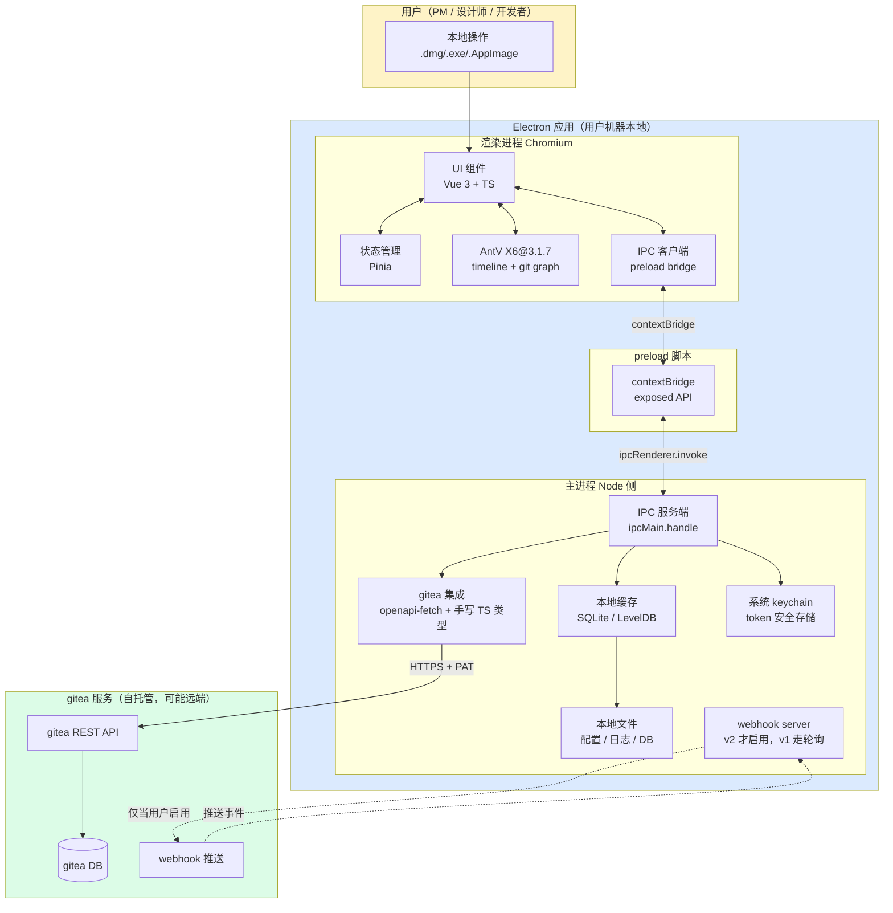
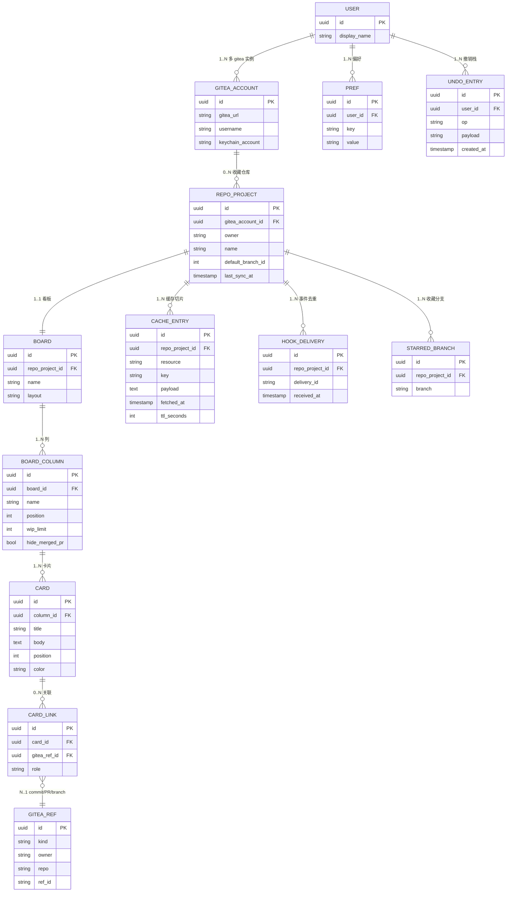
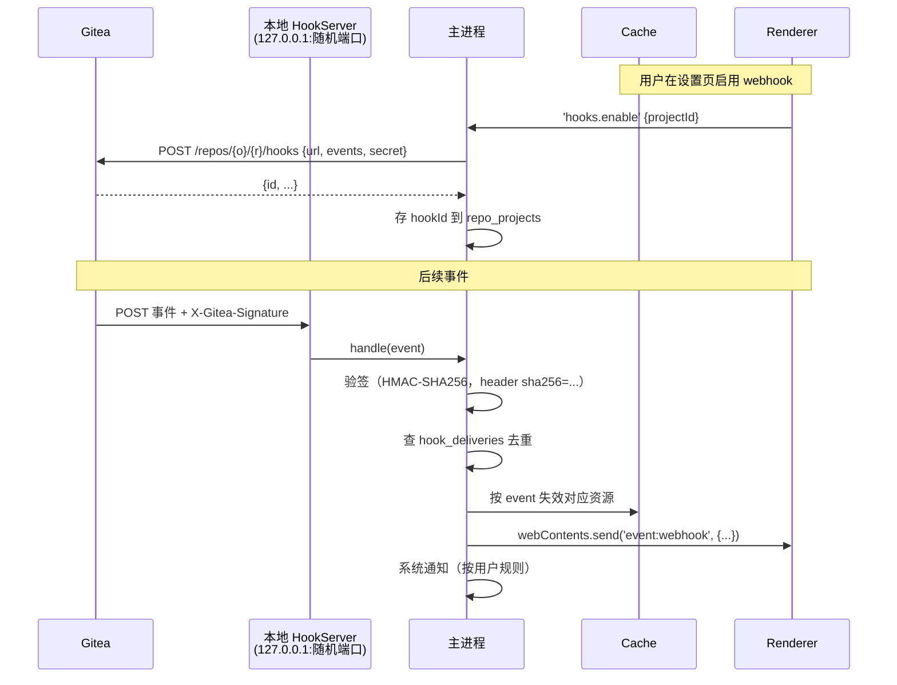
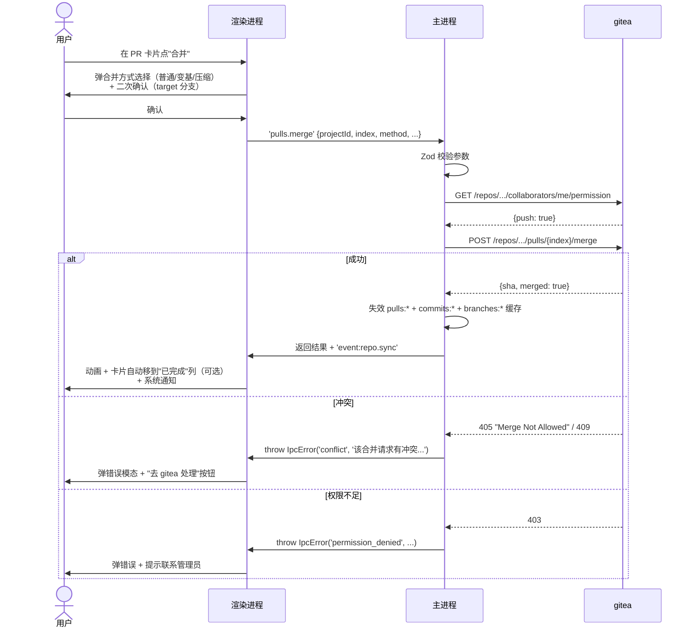

# 架构 + 后端设计：gitea-kanban

> 任务编号：architecture
> 输出时间：2026-06-10
> 上游依赖：`docs/design/01-research.md`
> 下游契约：实现期 mavis-team plan（前后端 agent）、`03-frontend.md` 复用 IPC 契约

---

## 用户决策记录

> 本节记录**对本架构有方向性影响**的用户决策，未来人/agent 改架构前必须先看这里。

| # | 时间 | 决策 | 影响范围 |
|---|------|------|----------|
| 1 | 2026-06-10 | **技术栈定型为 Electron + TypeScript 桌面应用**（不再是 Web + Go 后端 + SQLite + nginx 反代） | §1 架构图、§2 技术栈、§3 模块、§5 API 改为 IPC、§6 鉴权、§7 工作流、§8 agent 边界、§9 安全 |
| 2 | 2026-06-10 | **目标用户含非技术人员**（PM、设计师、市场、运营）——UI 必须零术语、危险操作二次确认、错误提示"人话" | §2 设计原则、§7 危险操作流程、§9 错误处理 |
| 3 | 2026-06-10 | **鉴权用 gitea Personal Access Token（PAT）+ 系统 keychain**，不做 OAuth2 跳转（桌面应用无必要） | §2 鉴权、§6 gitea 集成、§8 token 传递 |
| 4 | 2026-06-10 | **打包：macOS dmg 优先，Windows exe + Linux AppImage 跟上** | §2 部署形态、§9 打包/签名/分发 |
| 5 | 2026-06-10 | **不需要 nginx 反代、OAuth 回调、CSRF、公开 webhook URL**——桌面应用一切内网化 | §1 架构图（去掉公网入口）、§6 缓存策略（本地优先、远程兜底、断网只读） |
| 6 | 2026-06-10 | **后端 agent 边界变"主进程模块"，前端 agent 边界变"渲染进程 + IPC 契约"**，verifier / orchestrator 不变 | §8 agent 角色与接口契约 |

---

## 1. 整体架构图

桌面端单二进制，进程内分工。



**数据来源边界**（一图速记）：

| 数据 | 来自 | 在哪儿落地 | 何时失效 |
|---|---|---|---|
| 用户身份 / token | gitea | keychain（加密） | 用户主动重新登录 |
| 仓库元数据 | gitea API | 内存 + SQLite 缓存 | 30 min TTL 或用户点刷新 |
| 分支列表 | gitea API | 内存 + SQLite 缓存 | 5 min TTL + 用户主动刷新 |
| commit 列表 | gitea API | 内存 + SQLite 缓存（分页切片） | 10 min TTL + webhook / 轮询触发 |
| PR 列表 | gitea API | 内存 + SQLite 缓存 | 2 min TTL + webhook / 轮询触发 |
| 看板列定义 | **我们** | SQLite（用户私有） | 用户改写 |
| 卡片 ↔ commit/PR 关联 | **我们** | SQLite | 用户改写 |
| 收藏分支 | **我们** | SQLite | 用户改写 |
| 用户偏好（主题 / 视图） | **我们** | SQLite | 用户改写 |
| 日志 / 错误 | **我们** | 本地日志文件 | 滚动归档 |
| 通知 | 系统级 | OS 通知中心 | 立即消费 |

**网络断/弱时降级**：
- 远程调用失败 → 降级为本地缓存（标注"离线数据，最后更新 HH:MM"）
- 写操作（创建分支 / 合并 PR / 移动卡片）→ 提示"需要联网"，不假装成功
- webhook 服务关闭时 → 主进程按 30s 周期轮询仓库最新事件，避免错过

---

## 2. 技术栈定型

> 本节**基于 01-research.md 的推荐直接落地**，不再"评估"。

### 2.1 主框架

| 项 | 选型 | 说明 |
|---|---|---|
| **运行时** | **Electron**（最新稳定版，跟随官方 LTS） | 单二进制、跨平台、与用户本地资源零摩擦 |
| **语言** | **TypeScript 5.x** | 主进程 + 渲染进程 + preload 脚本统一 TS |
| **主进程框架** | **Electron main + electron-builder** | 不引第三方 Web 框架（不需要 HTTP server） |
| **构建** | **electron-vite** | 主进程 / 渲染进程 / preload 三端统一构建、HMR 友好 |
| **打包** | **electron-builder** | 产物 macOS dmg（优先）、Windows nsis exe、Linux AppImage |
| **代码签名** | macOS Developer ID + Windows Authenticode + Linux GPG（v1 仅 macOS 必须，其他 best-effort） | 见 §9 |

### 2.2 渲染进程（UI）

| 项 | 选型 | 说明 |
|---|---|---|
| **框架** | **Vue 3 + Vite**（Composition API + `<script setup>`） | 用户 2026-06-10 17:24 拍板（团队无 React 积累，Vue 3 在团队内有现成积累）；X6 通过 `@antv/x6-vue-shape` 官方桥接；TS 友好、Composition API 与 Pinia setup store 同源 |
| **状态管理** | **Pinia** | Vue 官方；setup store 风格与 Composition API 同源；TypeScript 类型推导完整；devtools / 持久化插件成熟 |
| **路由** | **Vue Router 4** | 官方；用 `createWebHashHistory` 适配 Electron（避免 file:// 协议下 hash 更稳） |
| **UI 组件库** | **Radix Vue（同一团队，unstyled primitives）+ @headlessui/vue 补缺 + CSS Modules** | Radix Vue 是 Radix UI 在 Vue 生态的对位（同一团队 unstyled primitives），提供可访问性 + 行为约束；如 Radix Vue 组件不够（dialog / dropdown / popover / toast）按需 `@headlessui/vue` 补。样式走 CSS Modules + CSS 变量（见 03-frontend.md §7.1）。**不引** antd / Element Plus / Naive UI（视觉太重）；**不引 Tailwind**（类名爆炸、运行时 / 编译开销与 OVERRIDE"克制 / 信息密度优先"风格冲突） |
| **timeline / git graph** | **AntV X6@3.1.7 + @antv/x6-vue-shape** | X6 本身框架无关；通过 `@antv/x6-vue-shape` 包把 Vue SFC 注册为 X6 节点（详见 §2.2.1） |
| **HTTP 客户端** | **原生 fetch** | 主进程内走，不在渲染进程起 HTTP（避免 CORS） |
| **数据校验** | **Zod** | 与 TS 类型双向同步，IPC 边界强制校验（前后端共用） |
| **测试** | **Vitest + @vue/test-utils + @testing-library/vue + Playwright（e2e）** | 见 §8 |

### 2.2.1 Vue 3 + X6 集成说明

> 单独列出本节是因为 X6 本身是框架无关的图编辑引擎，需要通过 **`@antv/x6-vue-shape`** 这个官方桥接包才能在 Vue 3 中把 SFC 注册为 X6 节点。

**桥接包用法**：

```ts
// src/renderer/features/timeline/CommitNode.ts
import { register } from '@antv/x6-vue-shape';
import CommitNodeVue from './CommitNode.vue';

// 把 Vue 组件注册为名为 'commit-node' 的 X6 节点
register({
  shape: 'commit-node',
  component: CommitNodeVue,
  // 可选：节点初始 attrs / 端口
});
```

**节点数据更新模式**（X6 是命令式 API，Vue 是声明式，需注意协调）：

- 节点**创建**走 `graph.addNode({ shape: 'commit-node', data: ... })`；初始 data 通过 `props.data` 透传到 SFC
- 节点**数据变化**走 `node.setData(nextData)` + `node.replaceData(nextData)`；X6 内部触发 SFC `props.data` 响应式更新，**不要**直接修改 props.data 字段
- 节点**视图**（位置 / 大小 / 样式）走 `node.position(x, y)` / `node.resize(w, h)` / `node.attr({ ... })`；这些不会触发 SFC 重渲染，仅更新 SVG attr
- 边连 / 拆 / 改属性走 `graph.addEdge` / `edge.remove` / `edge.attr`

**Pinia store 与 X6 实例的协调**：

- X6 graph 实例**不**放 Pinia store（避免序列化问题，graph 有大量循环引用），用 `ref` / `shallowRef` 在组件内持有
- Pinia 存 X6 需要的**结构化数据**（lanes / nodes / edges / prs），组件 `watch(store, () => graph.fromJSON(...))` 重建图，**或**逐 cell 调 `cell.setData()` 增量更新
- 节点 hover / 选中事件**从 X6 推回 Pinia**（`graph.on('node:mouseenter', ({ cell }) => store.setHovered(cell.id))`）以便侧栏 / 抽屉订阅

**已知坑**（同 AGENTS §8.4，Vue 版补充）：

- `interacting.*` 回调第一参数是 `cellView`（view），不是 cell；想拿 cell 用 `view.cell`
- 默认事件回调（`graph.on('node:moving', ...)`）第一参数是 `{ cell, view }` 对象
- attr 处理器只透传 SVG presentation 属性；CSS 属性走全局 stylesheet
- SFC 内**禁止**用 `v-html` 渲染 X6 节点数据（X6 节点内容默认走 text 渲染；如果需要复杂结构，把 X6 节点的 view 改为 foreignObject + Vue 组件渲染 + sanitize；v1 不实现 foreignObject 方案，统一用 attr-only 渲染）

### 2.3 主进程（本地服务层）

| 项 | 选型 | 说明 |
|---|---|---|
| **运行时** | **Node 20 LTS**（Electron 自带） | 与 Chromium 内核匹配 |
| **gitea 客户端** | **`openapi-fetch` + 手写 TS 类型**（或 `gitea-js` 备选） | 轻量、零运行时依赖膨胀；优先用 gitea 自带 OpenAPI 文档生成类型 |
| **SQLite 客户端** | **`better-sqlite3`** | 同步 API、零回调、性能远超 node-sqlite3 |
| **ORM** | **Drizzle ORM**（schema-first、TS 类型生成） | 轻量、迁移工具链成熟、SQLite/Postgres 抽象 |
| **migration** | **drizzle-kit** | schema diff 自动生成 SQL |
| **git CLI 调用** | **`simple-git`**（包装系统 git） | 仅在需要"本地克隆浅仓"等高级场景时用，v1 默认不走 git CLI |
| **keychain** | **`keytar`**（macOS Keychain / Windows Credential Vault / Linux Secret Service） | 跨平台 token 存储；后续若 keytar 维护停滞可换 `@napi-rs/keyring` |
| **日志** | **`pino`** + `pino-pretty`（开发） | 高性能、结构化 |
| **错误监控** | **本地日志 + Sentry（可选）** | 默认仅本地，Sentry 由用户在设置页填 DSN 后开启 |
| **测试** | **Vitest** | 与前端同套测试栈 |

### 2.4 存储

| 项 | 选型 | 说明 |
|---|---|---|
| **结构化数据** | **SQLite（文件型）** | 用户偏好 / 看板列 / 卡片关联 / 缓存元数据；落 `app.getPath('userData')/kanban.db` |
| **可选 KV** | **LevelDB（如果需要）** | 仅当 SQLite 写并发撞墙（实际不会，但留口子）；用 `level` 包 |
| **日志** | **滚动文件**，`app.getPath('logs')` 下按日切分 | |
| **blob（如头像缓存）** | **本地文件系统**，`userData/cache/` | |

> **不**额外引入 PostgreSQL / Redis / MongoDB。桌面应用单机单用户，SQLite 完全够用。

### 2.5 部署形态

| 平台 | 产物 | 分发方式 |
|---|---|---|
| macOS | `.dmg` | 官网下载 + Homebrew Cask（v2 考虑 Mac App Store） |
| Windows | `.exe`（NSIS） | 官网下载 + Chocolatey（v2） |
| Linux | `.AppImage` | 官网下载 + Flathub（v2） |

**更新机制**：`electron-updater`（基于 S3 / GitHub Releases），用户首次启动时检测更新、手动确认下载。

### 2.6 鉴权（gitea PAT + 系统 keychain）

**核心思路**：桌面应用 = 本机独占，无第三方泄密面，OAuth2 跳转 + 回调 URL 是负担，**直接用 PAT**。

| 步骤 | 行为 |
|---|---|
| 1. 首次启动 | 弹出"连接 gitea"页，提示用户去 gitea `Settings → Applications → Generate New Token` 创建一个 token，权限 `read:repository, read:issue, read:user, write:repository, write:issue` |
| 2. 粘贴 token | 用户粘贴进应用输入框 |
| 3. 存 keychain | 主进程调 `keytar.setPassword('gitea-kanban', giteaUrl, token)`；**绝不**存明文文件 / SQLite / 浏览器 localStorage |
| 4. 验证 | 用 token 调 `GET /api/v1/user`，成功则登录、跳主页；失败则提示"token 无效或权限不足，请到 gitea 重新生成" |
| 5. 后续使用 | 渲染进程不接触 token；所有 gitea 调用经 IPC 走主进程，主进程从 keychain 读 |

**多账号**：keychain key 用 `giteaUrl + 用户名` 区分，支持用户在多个 gitea 实例间切换。

### 2.7 设计原则（必须显式遵守）

> 本节是**用户决策 #2 的强制约束**，未来 mavis-team 实现 plan 不得违反。

1. **零术语**：UI 中所有"git 行话"翻译成"人话"——
   - PR → **合并请求**
   - merge → **合并**
   - rebase → **变基（重新整理提交顺序）** + hover 解释
   - squash → **压缩（把多个提交合成一个）** + hover 解释
   - force push → **强制推送（会覆盖远端历史）** + 二级红色警告
   - protected branch → **受保护分支（默认禁止直接推送，需走合并请求）**
2. **危险操作二次确认**：删除分支、强制推送、合并冲突覆盖、未测试合并——全部弹"二次确认"模态，写明后果（"将删除远端 5 个引用、影响 3 个合并请求"）。
3. **错误提示"人话"**：底层错误码 → 人类可读句子 + 解决建议。
   - `401 Unauthorized` → "登录已过期，请在 设置 → 账户 重新连接 gitea"
   - `409 Conflict` → "该分支已有同名合并请求存在"
   - `git merge conflict` → "合并冲突：文件 A、B 无法自动合并，请到 gitea 页面手工处理后再回来"
4. **hover/click 解释**：每个 timeline 节点、看板卡片、列头、按钮都至少有 `title` 或 popover 解释。
5. **撤销友好**：移动卡片、改列名、删除卡片等操作支持 `Ctrl+Z` 撤销（应用内栈，最近 20 步）。
6. **键盘可访问**：所有操作有快捷键，菜单栏和命令面板（`Cmd+K`）。

---

## 3. 后端模块划分（主进程 + IPC）

> 这里"后端"= Electron **主进程**。目录树按 electron-vite 标准布局。

```
gitea-kanban/
├── package.json
├── electron.vite.config.ts
├── tsconfig.json
├── tsconfig.node.json                # 主进程专属 TS 配置
├── electron-builder.yml              # 打包配置
├── drizzle.config.ts                 # DB 迁移
├── resources/                         # 图标 / 安装包资源
└── src/
    ├── main/                         # ========== 主进程 ==========
    │   ├── index.ts                  # 应用入口、生命周期、托盘
    │   ├── window.ts                 # BrowserWindow 管理（主窗 + 设置窗 + 通知窗预留；不做 OAuth 跳转）
    │   ├── ipc/                      # ========== IPC 路由层 ==========
    │   │   ├── index.ts              # 统一注册 ipcMain.handle
    │   │   ├── repo.ts               # 仓库相关 handler
    │   │   ├── branch.ts             # 分支相关 handler
    │   │   ├── commit.ts             # commit / timeline handler
    │   │   ├── pr.ts                 # PR / merge handler
    │   │   ├── board.ts              # 看板列 / 卡片 handler
    │   │   ├── user.ts               # 当前用户 / 偏好 handler
    │   │   └── schema.ts             # 全部 IPC schema（Zod）+ zod-to-ts 类型导出
    │   ├── gitea/                    # ========== gitea 集成层 ==========
    │   │   ├── client.ts             # gitea 客户端工厂（按 giteaUrl 缓存）
    │   │   ├── auth.ts               # PAT 校验、token 读写 keychain
    │   │   ├── repos.ts              # 仓库 API 包装
    │   │   ├── branches.ts
    │   │   ├── commits.ts
    │   │   ├── pulls.ts
    │   │   ├── issues.ts             # 看板卡片"绑 issue"场景
    │   │   ├── hooks.ts              # webhook 注册 / 解析 / 验签
    │   │   └── types.ts              # gitea API 响应类型
    │   ├── cache/                    # ========== 本地缓存 ==========
    │   │   ├── sqlite.ts             # better-sqlite3 单例 + 迁移
    │   │   ├── repos.ts              # 各资源的 cache aside
    │   │   ├── ttl.ts                # TTL 策略 + 失效器
    │   │   └── webhook-deliveries.ts # webhook 事件去重
    │   ├── board/                    # ========== 看板业务 ==========
    │   │   ├── columns.ts            # 列 CRUD
    │   │   ├── cards.ts              # 卡片 CRUD
    │   │   ├── link.ts               # 卡片 ↔ commit/PR 关联
    │   │   └── undo.ts               # 撤销栈
    │   ├── notify/                   # ========== 系统通知 ==========
    │   │   ├── os.ts                 # Electron Notification
    │   │   └── rules.ts              # 哪些事件触发通知
    │   ├── logger.ts                 # pino 实例
    │   ├── config.ts                 # 配置（gitea URL / 主题 / 缓存策略）
    │   └── store/                    # 配置 / 偏好持久化
    │       └── prefs.ts
    ├── preload/                      # ========== preload 桥 ==========
    │   ├── index.ts                  # contextBridge.exposeInMainWorld('api', api)
    │   └── api.d.ts                  # window.api 类型声明
    ├── renderer/                     # ========== 渲染进程 ==========
    │   ├── index.html
    │   ├── main.ts
    │   ├── App.vue
    │   ├── routes/                   # 路由级页面
    │   ├── components/               # 通用组件
    │   ├── features/                 # 业务特性（board / timeline / repo-list）
    │   ├── stores/                   # Pinia store
    │   ├── lib/                      # 工具
    │   └── styles/
    └── shared/                       # ========== 主/渲染共享 ==========
        ├── ipc-types.ts              # IPC 契约 TS 类型（自动从 Zod 导出）
        ├── errors.ts                 # 统一错误格式
        └── constants.ts
```

**每个模块一句话职责**：

| 模块 | 职责 |
|---|---|
| `main/index.ts` | 应用生命周期（ready / window-all-closed / activate）、单实例锁、托盘 |
| `main/window.ts` | 创建 / 恢复主窗口、设置窗口、记住窗口尺寸位置 |
| `main/ipc/*` | 接收渲染进程 IPC、Zod 校验、路由到业务层、返回结果 / 错误 |
| `main/gitea/*` | 包装 gitea HTTP API（fetch + PAT），做鉴权注入、错误规整、限流退避 |
| `main/cache/*` | 缓存读 / 写 / 失效；TTL 管理；webhook delivery 去重 |
| `main/board/*` | 看板列 / 卡片 / 关联的 CRUD 与业务规则（撤销栈） |
| `main/notify/*` | 操作系统通知、用户规则过滤 |
| `main/logger.ts` | pino 实例、结构化日志、日志滚动 |
| `main/config.ts` | 配置加载（首次启动向导、设置页持久化） |
| `preload/index.ts` | 把白名单 IPC 方法挂到 `window.api`，屏蔽 ipcRenderer 直接访问 |
| `renderer/*` | UI 组件、状态管理、路由、可视化 |
| `shared/*` | 主/渲染共享的 TS 类型 / 错误格式 / 常量 |

---

## 4. 数据模型

> 我们**只持久化"非 git 数据"**：用户身份 / 偏好 / 看板 / 关联 / 缓存元数据 / 撤销栈。**所有 git 数据（commit、PR 内容、issue 详情）一律不存**，用时现拉 gitea。
> 缓存层（见 §6）只缓存"上次拉到的切片"，不做派生数据持久化。

### 4.1 实体关系图



### 4.2 SQL DDL（Drizzle 风格，可直译为 SQL）

> 用 Drizzle schema-first 风格写，迁移由 `drizzle-kit` 生成。下面给出每张表 + 关键索引 / 外键 / 唯一约束。

```ts
// schema/users.ts
export const users = sqliteTable('users', {
  id: text('id').primaryKey(),                              // uuid v4
  displayName: text('display_name').notNull(),
  createdAt: integer('created_at', { mode: 'timestamp' }).notNull(),
});

// schema/giteaAccounts.ts
export const giteaAccounts = sqliteTable('gitea_accounts', {
  id: text('id').primaryKey(),
  giteaUrl: text('gitea_url').notNull(),                    // e.g. https://gitea.example.com
  username: text('username').notNull(),                     // gitea 登录用户名
  keychainAccount: text('keychain_account').notNull(),      // keytar 用的 account 字段
  createdAt: integer('created_at', { mode: 'timestamp' }).notNull(),
}, (t) => ({
  uniqUrlUser: uniqueIndex('uniq_url_user').on(t.giteaUrl, t.username),
}));

// schema/repoProjects.ts —— "项目映射"
export const repoProjects = sqliteTable('repo_projects', {
  id: text('id').primaryKey(),
  giteaAccountId: text('gitea_account_id').notNull().references(() => giteaAccounts.id, { onDelete: 'cascade' }),
  owner: text('owner').notNull(),                           // gitea 仓库 owner
  name: text('name').notNull(),                             // gitea 仓库 name
  defaultBranch: text('default_branch'),
  lastSyncAt: integer('last_sync_at', { mode: 'timestamp' }),
  createdAt: integer('created_at', { mode: 'timestamp' }).notNull(),
}, (t) => ({
  uniqAccountRepo: uniqueIndex('uniq_account_repo').on(t.giteaAccountId, t.owner, t.name),
}));

// schema/boards.ts
export const boards = sqliteTable('boards', {
  id: text('id').primaryKey(),
  repoProjectId: text('repo_project_id').notNull().references(() => repoProjects.id, { onDelete: 'cascade' }),
  name: text('name').notNull(),
  layout: text('layout').notNull().default('kanban'),       // kanban | timeline | split
  createdAt: integer('created_at', { mode: 'timestamp' }).notNull(),
}, (t) => ({
  uniqRepoBoard: uniqueIndex('uniq_repo_board').on(t.repoProjectId),
}));

// schema/boardColumns.ts
export const boardColumns = sqliteTable('board_columns', {
  id: text('id').primaryKey(),
  boardId: text('board_id').notNull().references(() => boards.id, { onDelete: 'cascade' }),
  name: text('name').notNull(),                             // "待办" / "进行中" / "已完成"
  position: integer('position').notNull(),                  // 0-based
  wipLimit: integer('wip_limit'),                           // null = 无限
  hideMergedPr: integer('hide_merged_pr', { mode: 'boolean' }).notNull().default(false),
  createdAt: integer('created_at', { mode: 'timestamp' }).notNull(),
}, (t) => ({
  idxBoardPos: index('idx_board_pos').on(t.boardId, t.position),
}));

// schema/cards.ts
export const cards = sqliteTable('cards', {
  id: text('id').primaryKey(),
  columnId: text('column_id').notNull().references(() => boardColumns.id, { onDelete: 'cascade' }),
  title: text('title').notNull(),
  body: text('body'),
  position: integer('position').notNull(),
  color: text('color'),                                     // 用户自选主题色
  createdAt: integer('created_at', { mode: 'timestamp' }).notNull(),
  updatedAt: integer('updated_at', { mode: 'timestamp' }).notNull(),
}, (t) => ({
  idxColPos: index('idx_col_pos').on(t.columnId, t.position),
}));

// schema/giteaRefs.ts —— "被关联的 git 对象"，只存引用，不存内容
export const giteaRefs = sqliteTable('gitea_refs', {
  id: text('id').primaryKey(),
  kind: text('kind').notNull(),                             // 'commit' | 'pr' | 'branch' | 'issue'
  owner: text('owner').notNull(),
  repo: text('repo').notNull(),
  refId: text('ref_id').notNull(),                          // sha / pr index / branch name / issue index
  cachedTitle: text('cached_title'),                        // 关联时的快照（仅展示用，过期可空）
  cachedAt: integer('cached_at', { mode: 'timestamp' }),
}, (t) => ({
  uniqKind: uniqueIndex('uniq_kind').on(t.kind, t.owner, t.repo, t.refId),
}));

// schema/cardLinks.ts —— 卡片 ↔ git 引用 多对多
export const cardLinks = sqliteTable('card_links', {
  id: text('id').primaryKey(),
  cardId: text('card_id').notNull().references(() => cards.id, { onDelete: 'cascade' }),
  giteaRefId: text('gitea_ref_id').notNull().references(() => giteaRefs.id, { onDelete: 'cascade' }),
  role: text('role').notNull().default('reference'),        // reference | blocks | relates-to
  createdAt: integer('created_at', { mode: 'timestamp' }).notNull(),
}, (t) => ({
  uniqCardRef: uniqueIndex('uniq_card_ref').on(t.cardId, t.giteaRefId, t.role),
  idxRefCard: index('idx_ref_card').on(t.giteaRefId, t.cardId),
}));

// schema/starredBranches.ts —— 收藏分支
export const starredBranches = sqliteTable('starred_branches', {
  id: text('id').primaryKey(),
  repoProjectId: text('repo_project_id').notNull().references(() => repoProjects.id, { onDelete: 'cascade' }),
  branch: text('branch').notNull(),
  createdAt: integer('created_at', { mode: 'timestamp' }).notNull(),
}, (t) => ({
  uniqRepoBranch: uniqueIndex('uniq_repo_branch').on(t.repoProjectId, t.branch),
}));

// schema/prefs.ts —— 用户偏好
export const prefs = sqliteTable('prefs', {
  id: text('id').primaryKey(),
  userId: text('user_id').notNull().references(() => users.id, { onDelete: 'cascade' }),
  key: text('key').notNull(),                               // 'theme' / 'timeline.scale' / 'notifications.pr_merged'
  value: text('value').notNull(),                           // JSON 字符串
  updatedAt: integer('updated_at', { mode: 'timestamp' }).notNull(),
}, (t) => ({
  uniqUserKey: uniqueIndex('uniq_user_key').on(t.userId, t.key),
}));

// schema/undoEntries.ts —— 撤销栈
export const undoEntries = sqliteTable('undo_entries', {
  id: text('id').primaryKey(),
  userId: text('user_id').notNull().references(() => users.id, { onDelete: 'cascade' }),
  op: text('op').notNull(),                                 // 'card.move' | 'card.delete' | 'col.create' | ...
  payload: text('payload').notNull(),                       // 反操作所需数据（JSON 字符串）
  createdAt: integer('created_at', { mode: 'timestamp' }).notNull(),
}, (t) => ({
  idxUserTime: index('idx_user_time').on(t.userId, t.createdAt),
}));

// schema/cacheEntries.ts —— 通用缓存元数据
export const cacheEntries = sqliteTable('cache_entries', {
  id: text('id').primaryKey(),
  repoProjectId: text('repo_project_id').references(() => repoProjects.id, { onDelete: 'cascade' }),
  resource: text('resource').notNull(),                     // 'branches' | 'commits' | 'pulls' | 'issues'
  key: text('key').notNull(),                               // 资源内切片 key，如 'page=1&limit=50&sha=main'
  payload: text('payload').notNull(),                       // JSON 字符串
  fetchedAt: integer('fetched_at', { mode: 'timestamp' }).notNull(),
  ttlSeconds: integer('ttl_seconds').notNull(),
}, (t) => ({
  uniqResKey: uniqueIndex('uniq_res_key').on(t.repoProjectId, t.resource, t.key),
  idxFetched: index('idx_fetched').on(t.fetchedAt),
}));

// schema/hookDeliveries.ts —— webhook delivery 去重
export const hookDeliveries = sqliteTable('hook_deliveries', {
  id: text('id').primaryKey(),
  repoProjectId: text('repo_project_id').references(() => repoProjects.id, { onDelete: 'cascade' }),
  deliveryId: text('delivery_id').notNull(),                // gitea 用 X-Gitea-Delivery
  receivedAt: integer('received_at', { mode: 'timestamp' }).notNull(),
}, (t) => ({
  uniqRepoDelivery: uniqueIndex('uniq_repo_delivery').on(t.repoProjectId, t.deliveryId),
  idxReceived: index('idx_received').on(t.receivedAt),
}));
```

### 4.3 不存的数据（纯透传 gitea API）

| 不存 | 原因 | 用时怎么拿 |
|---|---|---|
| commit 内容（sha / message / author / diff） | gitea 才是 source of truth，存了会过期 | `GET /repos/{owner}/{repo}/commits?sha=...&page=...&limit=...` |
| PR 内容（title / body / 评论 / review） | 同上 | `GET /repos/{owner}/{repo}/pulls/{index}` |
| issue 内容 | 同上 | `GET /repos/{owner}/{repo}/issues/{index}` |
| 分支指针 | 同上 | `GET /repos/{owner}/{repo}/branches/{branch}` |
| 标签 / release / wiki | v1 不做，pass-through | — |
| 仓库权限角色 | 实时从 gitea 拉，不缓存角色结论 | `GET /repos/{owner}/{repo}/collaborators/{username}/permission` |
| 用户头像 | 拉一次存本地文件，sha 命名做 ETag | `GET /user` → `avatar_url` |

---

## 5. API 设计（IPC 契约）

> 桌面应用**没有 HTTP**。所有"API"=**渲染进程 → preload bridge → 主进程 IPC**。
> 仍用 TypeScript interface 风格描述**契约**，与 03-frontend 共享同一份类型。

### 5.1 IPC 通道约定

| 通道 | 方向 | 形式 |
|---|---|---|
| **invoke** | renderer → main，请求-应答 | `ipcRenderer.invoke('namespace.method', args)` → `Promise<Result>` |
| **send/on** | main → renderer，事件推送 | `webContents.send('event', payload)` + 渲染侧 `window.api.onEvent(cb)` |
| **双向流** | renderer ↔ main，日志流 / 长任务进度 | `ipcRenderer.invoke` + 返回 `AsyncIterable` 不可行；用事件推送 |

**命名规范**：`<namespace>.<method>`，camelCase。
- `repos.list`
- `branches.list`
- `commits.list`
- `commits.timeline`（聚合多分支）
- `pulls.list`
- `pulls.merge`
- `board.columns.list`
- `board.cards.move`
- `user.prefs.get` / `user.prefs.set`
- `auth.connect` / `auth.disconnect` / `auth.status`

### 5.2 统一错误格式

```ts
// shared/errors.ts
export type IpcError = {
  code: string;          // 业务错误码，snake_case
  message: string;       // 已"人话化"的中文/英文消息（i18n 留 key）
  hint?: string;         // 建议下一步操作
  cause?: string;        // 原始错误信息（开发模式可见，生产折叠）
  httpStatus?: number;   // 来自 gitea 时透传
};

export const IpcErrorCode = {
  UNAUTHENTICATED: 'unauthenticated',
  TOKEN_INVALID: 'token_invalid',
  PERMISSION_DENIED: 'permission_denied',
  NOT_FOUND: 'not_found',
  CONFLICT: 'conflict',
  RATE_LIMITED: 'rate_limited',
  NETWORK_OFFLINE: 'network_offline',
  GITEA_ERROR: 'gitea_error',
  VALIDATION_FAILED: 'validation_failed',
  INTERNAL: 'internal',
} as const;
```

所有 IPC handler `throw new IpcError({...})`；preload 把 reject 转成 typed `Result<T, IpcError>`。

### 5.3 关键 IPC endpoint 清单

> 完整清单见 `src/shared/ipc-types.ts`（由 Zod 自动生成 TS 类型）。下表给"必含"项。

#### 5.3.1 仓库

```ts
// REQ
interface ListReposArgs {
  giteaAccountId: string;
  query?: string;                 // 搜索关键字
  limit?: number;                 // default 50
  page?: number;                  // default 1
}
interface RepoDTO {
  id: number;                     // gitea 仓库 id
  owner: string;
  name: string;
  fullName: string;
  description: string;
  defaultBranch: string;
  archived: boolean;
  private: boolean;
  updatedAt: string;              // ISO
  permissions: { pull: boolean; push: boolean; admin: boolean };
  // 我们的扩展
  isProject?: boolean;            // 是否被添加为"项目"（在我们库里）
  lastSyncAt?: string;
}

// RESP
type ListReposResp = {
  items: RepoDTO[];
  total: number;
  page: number;
  hasMore: boolean;
};

// IPC
'repos.list': (args: ListReposArgs) => Promise<ListReposResp>;
'repos.addProject': (args: { giteaAccountId: string; owner: string; name: string }) => Promise<RepoProjectDTO>;
'repos.removeProject': (args: { projectId: string }) => Promise<void>;
```

#### 5.3.2 分支

```ts
interface ListBranchesArgs { projectId: string; query?: string; limit?: number; page?: number; }
interface BranchDTO {
  name: string;
  sha: string;
  protected: boolean;
  isDefault: boolean;
  // 我们的扩展
  starred: boolean;
  lastCommit?: { sha: string; message: string; author: string; date: string };
}

'branches.list': (args: ListBranchesArgs) => Promise<{ items: BranchDTO[]; total: number; hasMore: boolean }>;
'branches.create': (args: { projectId: string; newBranch: string; fromBranch: string }) => Promise<BranchDTO>;
'branches.rename': (args: { projectId: string; oldName: string; newName: string }) => Promise<BranchDTO>;
'branches.delete': (args: { projectId: string; branch: string }) => Promise<void>;
'branches.star':   (args: { projectId: string; branch: string; starred: boolean }) => Promise<void>;
```

#### 5.3.3 commit 列表

```ts
interface ListCommitsArgs {
  projectId: string;
  sha?: string;                  // 分支 / tag / sha
  path?: string;                 // 文件路径过滤
  author?: string;               // 作者过滤
  since?: string;                // ISO 时间
  until?: string;
  page?: number;                 // default 1
  limit?: number;                // default 50
}
interface CommitDTO {
  sha: string;
  shortSha: string;
  message: string;
  author: { name: string; email: string; avatarUrl?: string };
  committer: { name: string; email: string };
  date: string;
  parents: string[];
  // 我们的扩展
  linkedCards?: Array<{ cardId: string; columnName: string }>;
}

'commits.list': (args: ListCommitsArgs) => Promise<{ items: CommitDTO[]; total: number; hasMore: boolean; nextPage: number | null }>;
'commits.get':   (args: { projectId: string; sha: string }) => Promise<CommitDTO>;
```

#### 5.3.4 commit 时间轴（聚合多分支）—— IPC 单一来源

> **本节是 Timeline 结构的 single source of truth**。03-frontend.md §5.2 字段必须与本节严格一致；
> 任何字段增减 → 先改本节，再让前端同步。X6 渲染骨架（lanes/PR 标签/lane 过滤）依赖
> 完整字段（lanes/prs/range/totalCommits），不是装饰字段。

```ts
// === Args（IPC 入参）===
interface TimelineArgs {
  projectId: string;
  branches: string[];            // 选中的分支（最多 10）
  since?: string;                // 同 range.from
  until?: string;                // 同 range.to
  maxNodes?: number;             // default 500，超出提示用户缩窗
  laneMode?: 'branch' | 'author' | 'pr';  // 决定 lanes[i].kind 集合
}

// === Lanes（X6 渲染骨架：每条泳道一个分支 / 作者 / PR）===
interface Lane {
  id: string;             // "branch:main" / "author:alice" / "pr:42"
  label: string;          // 显示文本
  kind: 'branch' | 'author' | 'pr';
  color: string;          // #609926 绿（主分支）/ #f76707 橙（活跃开发）/ #6c757d 灰（archived）
  order: number;          // y 轴排序（默认 main 在最上、其它按活跃度）
  hidden?: boolean;
}

// === Commit 节点（每个 commit / 合并点）===
interface CommitNode {
  id: string;             // sha
  laneId: string;         // 归属到哪条 lane
  x: number;              // 横向时间位置（由 from/to 归一化）
  y: number;              // 纵向 lane 位置
  sha: string;
  shortSha: string;       // 7 位
  message: string;        // commit message 第一行
  author: { name: string; avatarUrl?: string };
  timestamp: string;      // ISO
  parents: string[];      // 父 commit sha 列表
  isMerge: boolean;       // parents 数量 > 1
  branchHints: string[];  // 该 commit 出现在哪些分支的 history 上
  linkedCardIds: string[];// 关联到本地卡片（来自 card_links JOIN gitea_refs，见 §4.2 + §5.3.8）
  additions: number;
  deletions: number;
  filesChanged: number;
}

// === 边（父子关系 / 合并关系）===
interface ParentEdge {
  id: string;
  source: string;         // source node id
  target: string;         // target node id
  kind: 'parent' | 'merge';  // parent = 直接父子；merge = 合并 PR 时产生
  prIndex?: number;       // merge 时填，链接到 PR
}

// === PR 列表（高亮用）===
interface TimelinePR {
  id: string;             // gitea PR id
  index: number;          // PR 全局编号
  title: string;
  state: 'open' | 'closed' | 'merged';
  head: string;           // 源分支
  base: string;           // 目标分支
  author: { name: string; avatarUrl?: string };
  url: string;            // gitea web URL
  mergedAt?: string;      // ISO
}

// === DTO（IPC 出参）===
interface TimelineDTO {
  // 时间窗（与 TimelineArgs.since/until 双名同义）
  windowStart?: string;   // ISO；与 range.from 等价
  windowEnd?: string;     // ISO；与 range.to 等价
  range: { from: string /* ISO */; to: string };

  // 渲染骨架
  lanes: Lane[];
  nodes: CommitNode[];
  edges: ParentEdge[];
  prs: TimelinePR[];

  // 性能与降级
  truncated: boolean;     // 节点数超过 maxNodes 时为 true
  totalCommits: number;   // 满足过滤条件的总 commit 数（含被截断未返回的）
}

'commits.timeline': (args: TimelineArgs) => Promise<TimelineDTO>;
```

#### 5.3.5 PR 列表

```ts
interface ListPullsArgs {
  projectId: string;
  state?: 'open' | 'closed' | 'all';
  head?: string;                 // 源分支
  base?: string;                 // 目标分支
  author?: string;
  page?: number;
  limit?: number;
}
interface PullDTO {
  index: number;
  title: string;
  state: 'open' | 'closed';
  draft: boolean;
  merged: boolean;
  head: { ref: string; sha: string };
  base: { ref: string; sha: string };
  author: { username: string; avatarUrl?: string };
  createdAt: string;
  updatedAt: string;
  mergeable: boolean;
  hasConflicts: boolean;
  // 我们的扩展
  linkedCards?: Array<{ cardId: string; columnName: string }>;
}

'pulls.list': (args: ListPullsArgs) => Promise<{ items: PullDTO[]; total: number; hasMore: boolean }>;
'pulls.get':   (args: { projectId: string; index: number }) => Promise<PullDTO>;
'pulls.create':(args: { projectId: string; head: string; base: string; title: string; body?: string; draft?: boolean }) => Promise<PullDTO>;
```

#### 5.3.6 合并 PR

```ts
interface MergePrArgs {
  projectId: string;
  index: number;
  method: 'merge' | 'rebase' | 'rebase-merge' | 'squash' | 'squash-merge';
  // 用户友好映射
  // merge            → "普通合并（保留所有提交历史）"
  // rebase           → "变基后快进（重写历史，单一线性）"
  // squash           → "压缩为单提交（合并请求内 N 个提交合成 1 个）"
  deleteBranchAfter?: boolean;
  commitMessage?: string;        // squash 时必填
}
interface MergePrResult { sha: string; merged: boolean; message: string; }

'pulls.merge': (args: MergePrArgs) => Promise<MergePrResult>;
```

#### 5.3.7 看板列

```ts
interface ColumnDTO {
  id: string;
  boardId: string;
  name: string;
  position: number;
  wipLimit: number | null;
  hideMergedPr: boolean;
  cardCount: number;
}

'board.columns.list':   (args: { projectId: string }) => Promise<ColumnDTO[]>;
'board.columns.create': (args: { projectId: string; name: string; position: number; wipLimit?: number }) => Promise<ColumnDTO>;
'board.columns.update': (args: { columnId: string; patch: Partial<Pick<ColumnDTO, 'name'|'wipLimit'|'hideMergedPr'>> }) => Promise<ColumnDTO>;
'board.columns.reorder':(args: { projectId: string; orderedIds: string[] }) => Promise<void>;
'board.columns.delete': (args: { columnId: string; moveCardsTo?: string }) => Promise<void>;
```

#### 5.3.8 卡片

```ts
interface CardDTO {
  id: string;
  columnId: string;
  title: string;
  body?: string;
  position: number;
  color?: string;
  createdAt: string;
  updatedAt: string;
  links: CardLinkDTO[];
}

interface CardLinkDTO {
  id: string;
  refKind: 'commit' | 'pr' | 'branch' | 'issue';
  owner: string;
  repo: string;
  refId: string;
  cachedTitle?: string;
  role: 'reference' | 'blocks' | 'relates-to';
}

'board.cards.list':    (args: { columnId: string }) => Promise<CardDTO[]>;
'board.cards.create':  (args: { columnId: string; title: string; body?: string; position: number; color?: string; links?: Array<Omit<CardLinkDTO,'id'>> }) => Promise<CardDTO>;
'board.cards.update':  (args: { cardId: string; patch: Partial<Pick<CardDTO,'title'|'body'|'color'>> }) => Promise<CardDTO>;
'board.cards.move':    (args: { cardId: string; toColumnId: string; toPosition: number }) => Promise<CardDTO>;
'board.cards.delete':  (args: { cardId: string }) => Promise<void>;
'board.cards.link':    (args: { cardId: string; link: Omit<CardLinkDTO,'id'> }) => Promise<CardLinkDTO>;
'board.cards.unlink':  (args: { linkId: string }) => Promise<void>;
```

#### 5.3.9 鉴权 / 用户 / 偏好

```ts
'auth.connect':    (args: { giteaUrl: string; token: string }) => Promise<{ account: GiteaAccountDTO; user: UserDTO }>;
'auth.disconnect': (args: { accountId: string }) => Promise<void>;
'auth.status':     () => Promise<{ accounts: GiteaAccountDTO[]; currentUser: UserDTO | null }>;
'user.prefs.get':  (args: { keys: string[] }) => Promise<Record<string, unknown>>;
'user.prefs.set':  (args: { entries: Record<string, unknown> }) => Promise<void>;
'user.undo':       () => Promise<{ restored: number }>;
'user.redo':       () => Promise<{ restored: number }>;
```

#### 5.3.10 主进程 → 渲染事件推送

```ts
// 订阅模式：渲染侧 window.api.onXxx(cb)
'event:repo.sync':     { projectId: string; status: 'started'|'done'|'error'; error?: IpcError }
'event:webhook':       { projectId: string; event: 'push'|'pull_request'|'create'|'delete'; payload: unknown }
'event:notify':        { level: 'info'|'warn'|'error'; title: string; body: string; source: 'merge'|'review'|'mention' }
'event:cache.invalid': { projectId: string; resource: string }
'event:network':       { online: boolean }
'event:app.update':    { available: boolean; version?: string }
```

### 5.4 错误码表（业务层 + gitea 透传）

| code | 触发 | 用户提示（中文默认，i18n 留 key） | hint |
|---|---|---|---|
| `unauthenticated` | 没接 gitea / token 失效 | "请先在 设置 → 账户 连接 gitea" | 跳连接页 |
| `token_invalid` | 401 from gitea | "登录已过期或 token 无效" | "请到 gitea 重新生成 token" |
| `permission_denied` | 403 from gitea | "你没有该操作权限（需要 Write 或更高）" | "请联系仓库管理员" |
| `not_found` | 404 | "找不到该资源（可能已被删除）" | 提示刷新 |
| `conflict` | 409 | "操作冲突：资源已存在或状态不允许" | 给出当前状态 |
| `rate_limited` | 429 | "请求过于频繁，已自动重试" | 显示下次可重试时间 |
| `network_offline` | 离线 | "当前离线，仅显示已缓存数据" | 提供"重试"按钮 |
| `gitea_error` | 其他 5xx | "gitea 服务异常" | 附 gitea 返回的 message |
| `validation_failed` | Zod 校验失败 | "输入不合法" | 高亮出错的字段 |
| `internal` | 本地 bug | "应用内部错误，已记录日志" | 附日志路径 |

---

## 6. gitea 集成方案

### 6.1 鉴权（PAT + keychain）

**首次接入流程**（与 §2.6 配合）：

```ts
// 渲染进程
const result = await window.api.invoke('auth.connect', {
  giteaUrl: 'https://gitea.example.com',
  token: 'ghp_xxx...',   // 用户粘贴
});
// → 主进程 handler
ipcMain.handle('auth.connect', async (_, args) => {
  // 1. 调 gitea 验证 token
  const user = await giteaFetch(args.giteaUrl, '/user', { token: args.token });
  if (!user) throw new IpcError('token_invalid');

  // 2. 存 keychain（绝不存明文）
  await keytar.setPassword(
    `gitea-kanban@${args.giteaUrl}`,
    user.login,
    args.token,
  );

  // 3. 写 SQLite gitea_accounts（不含 token）
  const account = db.insert(giteaAccounts).values({
    id: uuid(), giteaUrl: args.giteaUrl, username: user.login,
    keychainAccount: `gitea-kanban@${args.giteaUrl}:${user.login}`,
  }).returning().get();

  return { account, user };
});
```

**后续请求**：主进程 gitea client 工厂按 `(giteaUrl, username)` 索引，每次调用都从 keychain 读 token → 设 `Authorization: token <pat>` → fetch。

**多账号**：keychain service = `gitea-kanban@<url>`，account = `<username>`，互不干扰。

**登出**：`auth.disconnect` → `keytar.deletePassword(...)` → 删 `gitea_accounts` 行（级联删 `repo_projects` 等）。

### 6.2 数据走 gitea API（endpoint 清单）

| 资源 | endpoint | 用在哪儿 | 缓存策略 |
|---|---|---|---|
| 当前用户 | `GET /user` | 鉴权校验、显示头像 | 不缓存 |
| 仓库列表 | `GET /repos/search?uid={id}` / `GET /orgs/{org}/repos` | 仓库选择 | TTL 30 min + 用户刷新 |
| 仓库元数据 | `GET /repos/{owner}/{repo}` | 仓库头 | TTL 30 min |
| 仓库权限 | `GET /repos/{owner}/{repo}/collaborators/{username}/permission` | UI 按钮 enable/disable | **不缓存**（每次操作前查） |
| 分支列表 | `GET /repos/{owner}/{repo}/branches?page=&limit=` | 分支面板、timeline 选支 | TTL 5 min + 失效 |
| 单分支 | `GET /repos/{owner}/{repo}/branches/{branch}` | 看 head 指针 | TTL 5 min |
| 创建分支 | `POST /repos/{owner}/{repo}/branches` | 写操作 | 立即写穿 + 失效列表 |
| 删除分支 | `DELETE /repos/{owner}/{repo}/branches/{branch}` | 写操作 | 立即失效 |
| commit 列表 | `GET /repos/{owner}/{repo}/commits?sha=&page=&limit=` | 时间轴 | TTL 10 min + 分页切片 |
| 单 commit | `GET /repos/{owner}/{repo}/git/commits/{sha}` | 详情 | TTL 10 min |
| PR 列表 | `GET /repos/{owner}/{repo}/pulls?state=&page=&limit=` | PR 面板 | TTL 2 min |
| 单 PR | `GET /repos/{owner}/{repo}/pulls/{index}` | 详情 | TTL 2 min |
| 创建 PR | `POST /repos/{owner}/{repo}/pulls` | 写操作 | 立即失效列表 |
| 合并 PR | `POST /repos/{owner}/{repo}/pulls/{index}/merge` | 写操作 | 立即失效 commits + pulls |
| PR 冲突 | `GET /repos/{owner}/{repo}/pulls/{index}` 看 `mergeable` | UI 提示 | 不缓存 |
| Issue 列表 | `GET /repos/{owner}/{repo}/issues?state=` | 卡片"绑 issue" | TTL 5 min |
| Webhook 列表 | `GET /repos/{owner}/{repo}/hooks` | 启动时核对 | TTL 1 h |
| 注册 Webhook | `POST /repos/{owner}/{repo}/hooks` | 首次启用 | 写穿 |
| 删除 Webhook | `DELETE /repos/{owner}/{repo}/hooks/{id}` | 关闭 | 写穿 |

### 6.3 缓存策略（本地优先、远程兜底、断网只读）

**通用规则**：
- **cache-aside** 模式：渲染进程请求 → 主进程查缓存 → 命中且未过期 → 返回；否则调 gitea → 回写缓存 → 返回。
- 写操作（创建/删除/合并）**不写缓存**，只失效缓存。
- 缓存 key：`(repoProjectId, resource, key)`，TTL 见上表。
- 失效触发器：
  1. **TTL 到期**（最常见）
  2. **写操作完成后立即按 resource 失效**（`branches.create` → 删 `branches:*` 缓存）
  3. **webhook 推送**（`push` → 删 `commits:*` + `branches:*`；`pull_request` → 删 `pulls:*` + `commits:*`）
  4. **手动刷新**（UI 按钮，bypass 缓存直拉）
  5. **离线模式**：fetch 失败 → 返回 stale 缓存（即使已过期），标 `stale: true`，UI 显示"最后更新 HH:MM"

**webhook 与轮询的降级**：v1 默认**不开本地 webhook server**（避免用户开防火墙/端口冲突），主进程按以下周期后台轮询：
- `pulls` 30 s
- `commits` 2 min
- `branches` 5 min

**v2 才提供**"启用本地 webhook server"选项（在设置页勾选），开启后用 `electron-updater` 同源的 Express 内嵌 HTTP server，绑 `127.0.0.1:<随机端口>`，把端口 URL 写回 gitea webhook config。

### 6.4 webhook 订阅与本地处理（v2 高级）

v2 启用 webhook 后的流程：



**验签伪代码**：

```ts
import { createHmac, timingSafeEqual } from 'node:crypto';

function verifyGiteaSignature(rawBody: string, header: string, secret: string) {
  const expected = 'sha256=' + createHmac('sha256', secret).update(rawBody).digest('hex');
  const a = Buffer.from(header);
  const b = Buffer.from(expected);
  return a.length === b.length && timingSafeEqual(a, b);
}
```

**幂等**：gitea 的 `X-Gitea-Delivery` 头唯一标识一次推送，写入 `hook_deliveries` 表（唯一索引 `(repoProjectId, deliveryId)`），重复则 short-circuit。

**失败处理**：本地 hook server 返回 5xx → gitea 端会重试（gitea 默认 5 次指数退避）；我们 idempotent，重复事件安全。

---

## 7. 分支 / 合并 / PR 工作流

### 7.1 工具内可执行操作清单

| # | 操作 | 写权限要求 | 内部流程 | gitea API |
|---|------|----------|---------|-----------|
| 1 | **查看分支列表** | read | 缓存 → 远程兜底 | `GET /repos/.../branches` |
| 2 | **收藏 / 取消收藏分支** | 无（本地） | 写 SQLite | — |
| 3 | **创建分支** | write | ① 二次确认"从 main 创建 feature-x？"<br>② 写穿 + 失效 `branches:*` 缓存 | `POST /repos/.../branches` |
| 4 | **重命名分支** | write | ① 二次确认（提示会影响 N 个合并请求 / N 个引用）<br>② gitea 实际不支持直接 rename API，**走"新建 + 推送 + 删旧"三步**（v1 不实现，仅在 UI 提示"到 gitea 页面操作"） | — |
| 5 | **删除分支** | write | ① 二次确认"将删除远端 1 个分支 + 关闭 N 个合并请求"<br>② 写穿 | `DELETE /repos/.../branches/{branch}` |
| 6 | **查看 commit 列表 / 时间轴** | read | 缓存 → 远程 | `GET /repos/.../commits` |
| 7 | **查看单 commit** | read | 缓存 → 远程 | `GET /repos/.../git/commits/{sha}` |
| 8 | **查看 PR 列表** | read | 缓存 → 远程 | `GET /repos/.../pulls` |
| 9 | **创建合并请求** | write | ① 表单（head / base / 标题 / 描述）<br>② 写穿 | `POST /repos/.../pulls` |
| 10 | **合并合并请求** | write | ① 选合并方式（普通 / 变基 / 压缩，**每个 hover 显示解释**）<br>② 二次确认"将合并到 main，关闭 1 个合并请求"<br>③ 写穿 + 失效 pulls + commits + branches | `POST /repos/.../pulls/{index}/merge` |
| 11 | **查看冲突** | read | 读 PR `mergeable` 字段；如 `false` 显示"该合并请求有冲突，请到 gitea 页面处理" + 跳链 | `GET /repos/.../pulls/{index}` |
| 12 | **关闭合并请求（不合并）** | write | 二次确认 | `PATCH /repos/.../pulls/{index}` 改 state |
| 13 | **卡片绑定 commit/PR/branch** | 无（本地） | 写 SQLite `card_links` | — |
| 14 | **从合并请求"提升"为卡片** | 无 | 写 SQLite | — |
| 15 | **从卡片"创建合并请求"** | write | 写穿 + 跳到 PR 详情 | `POST /repos/.../pulls` |

### 7.2 权限校验点

> **原则**：所有写操作都先在主进程**实时**调 gitea `GET /repos/{owner}/{repo}/collaborators/{username}/permission`，校验 `push === true`（或更高）才执行。

| 触发点 | 校验 API | 不通过时的 UI 表现 |
|---|---|---|
| UI 渲染时（页面打开） | 拉权限 + 缓存 1 min | 写按钮置灰 + tooltip "需要 Write 权限" |
| 用户点击写按钮 | 同上 + 强制再查一次 | 弹错误"权限不足，请联系仓库管理员" |
| 主进程执行写操作前 | 强校验（不依赖 UI） | 返回 `permission_denied` 错误码 |
| 合并方式选择 `rebase` / `force push` | 同上 + 检查 gitea 仓库 settings 是否允许 | 弹窗"该合并方式被 gitea 仓库设置禁用" |

**注意**：gitea 的 "protected branch" 规则我们不复制；用户操作时让 gitea 拒绝并把 `403` / `405` 错误以"人话"展示。

### 7.3 危险操作（用户决策 #2 强制）—— 二次确认清单

> 以下操作必须弹"二次确认"模态，写明"将影响什么"。

| 操作 | 二次确认文案（必须含"后果"） | 默认按钮 |
|---|---|---|
| 删除分支 | "将永久删除远端分支 `feature-x`，关闭关联的 N 个合并请求，且引用该分支的所有页面会失效" | 红色"删除" |
| 强制推送 | 不在 v1 工具中暴露（v2 考虑） | — |
| 合并到 main/master | "将合并到 `main`（默认分支），影响所有协作者的工作流" | 默认按钮改为"我了解风险，仍要合并" |
| 压缩合并 | "将把 N 个提交压缩为 1 个，原始提交历史无法恢复" | "压缩合并" |
| 删除列 | "将删除列 `进行中`，并把 N 张卡片移入 `已完成`"（让用户选"移到哪列"） | 红色"删除" |
| 删除卡片 | "将删除卡片 `xxx` 及其 N 个关联" | 红色"删除" |
| 重新连接 gitea（清 token） | "将清空当前 gitea 账户的所有本地数据" | 红色"重置" |
| 取消绑定卡片 ↔ commit | "将断开卡片与 commit `abc1234` 的关联" | "断开" |

### 7.4 操作流程图（典型合并 PR）



---

## 8. 前后端 agent 角色与接口契约

> 给未来 mavis-team 实现 plan 用的分工。**前端 agent = 渲染进程 agent**，**后端 agent = 主进程 agent**。

### 8.1 角色边界

| 维度 | 后端 agent（主进程） | 前端 agent（渲染进程） |
|---|---|---|
| 职责 | 主进程所有代码：IPC handler、gitea 集成、缓存、SQLite、keychain、webhook server（v2）、日志、轮询 | 渲染进程所有代码：UI 组件、状态管理、路由、可视化（X6）、IPC 客户端 |
| 依赖 | `electron`, `better-sqlite3`, `drizzle-orm`, `pino`, `keytar` / `@napi-rs/keyring`, `openapi-fetch` | `vue`, `pinia`, `vue-router`, `@antv/x6`, `@antv/x6-vue-shape`, `zod`, `@radix-vue/*`, `@headlessui/vue`, `lucide-vue-next` |
| 不允许 | 写 UI / 写 Vue 组件 / 写 CSS | 写主进程代码 / 调 gitea API 直连 / 碰 keychain / 碰 SQLite |
| 共享 | `src/shared/*`（TS 类型、错误格式、常量）由后端 agent 写 schema，前端 agent 消费类型 | |
| 测试 | Vitest（主进程单测、mock gitea HTTP） | Vitest（组件单测）+ Playwright（e2e，跨主+渲染） |
| 谁负责 mock | **后端 agent** 写 gitea API mock（MSW 拦截 fetch + 静态 fixtures） | **前端 agent** 在开发期连 mock 起前端 |
| 谁负责 e2e | **共同**：playwright 启动应用（`electron-playwright-helper`）+ 跨进程 assertion | |

### 8.2 接口契约（IPC 类型 + 错误码 + 事件推送）

**唯一信息源**：`src/shared/ipc-types.ts`（由 Zod schema 派生，**前后端编译时共用**）。

- **后端 agent 责任**：
  - 在 `src/main/ipc/schema.ts` 用 Zod 定义每个 IPC 的 args / return
  - 用 `zod-to-ts` 导出 TS 类型到 `src/shared/ipc-types.ts`
  - 在 `preload/index.ts` 把方法白名单挂到 `window.api`
- **前端 agent 责任**：
  - 仅 `import type { ... } from '@shared/ipc-types'`
  - **不**自己重写类型
  - 任何字段不匹配 → 提 issue 让后端改 schema（**不能前端自己造类型绕过**）

### 8.3 鉴权 token 传递（用户决策 #3）

> **桌面应用：渲染进程不接触 token**。

- token 只存在于 **主进程的内存**（每次请求从 keychain 读，写内存缓存 5 min）
- IPC 协议中**绝不**含 `token` 字段
- `auth.connect` 是唯一接收 token 的 handler，且 token 仅这一次从渲染进程传到主进程；之后所有 gitea 调用在主进程内部完成
- 渲染进程通过 `auth.status` 看"是否已连接"，但拿不到 token 本身

### 8.4 验收契约（实现 plan 必须满足）

| 项 | 验收方 |
|---|---|
| 所有 gitea 写操作都走 IPC handler，不在渲染进程直连 | 后端 agent 单测覆盖 |
| 所有 IPC schema 在 `src/shared/ipc-types.ts` 集中 | grep 验证 `ipcMain.handle` 数 = `window.api` 暴露数 |
| 危险操作都弹二次确认 | 前端 e2e + 视觉走查 |
| 错误码都用统一 `IpcError` | 后端 agent lint 规则 |
| 零术语：UI 文本不含 `PR` / `merge` / `rebase` 等原词（用中文业务词） | 前端 agent 跑 `pnpm check:no-jargon` 脚本 |
| keychain 路径在 Linux 不可用时降级为加密文件 | 后端 agent 启动时探针 |
| 离线模式：网络断开时不崩、显示 stale 缓存 | e2e 跑"断网"场景 |
| sqlite 路径在 `app.getPath('userData')` | 后端 agent 单测 |
| macOS dmg 产物可双击安装并启动 | e2e 在 CI mac runner 跑 |

### 8.5 mavis-team 实现 plan 的建议拆分

| Plan 子任务 | 负责 agent | 输入 | 输出 |
|---|---|---|---|
| 1. 项目脚手架（electron-vite + tsconfig + 打包配置） | 后端 | 本文档 §2、§3 | 仓库可 `pnpm dev` 跑 |
| 1a. **keytar 评估与备选方案**（keytar 上次 release 2022 年已无人维护；M0 阶段需评估 `@napi-rs/keyring` / Electron `safeStorage` + 加密文件 / 继续 keytar） | 后端 | `§2.3 keychain` + 各备选文档 | **明确给出 M1 选型结论**（含理由 + 触发条件：如 keytar 在 macOS arm64 装不上 → 切 `@napi-rs/keyring`）；输出 ADR 落到 `docs/adr/0001-keychain.md` |
| 2. 主进程骨架（窗口 / IPC 路由 / 错误格式 / 日志） | 后端 | §3、§5 错误格式 | 空 handler 返回 `not_implemented` |
| 3. 鉴权 + gitea client + keychain | 后端 | §6.1、§6.2 + 任务 1a 选型结论 | `auth.connect/disconnect/status` 跑通 |
| 4. 数据模型 + migration | 后端 | §4 | drizzle schema + `pnpm db:migrate` 跑通 |
| 5. 仓库 / 分支 / commit / pulls IPC handler | 后端 | §5.3.1–5.3.6 + §6.2 缓存策略 | 全 read API 跑通 |
| 6. 看板 / 卡片 / 关联 IPC handler | 后端 | §5.3.7、§5.3.8 | 全 CRUD 跑通 |
| 7. 危险操作守卫（权限 + 二次确认在主进程） | 后端 | §7.2、§7.3 | handler 层强制校验 |
| 8. 渲染进程脚手架（路由 / 主题 / IPC 客户端） | 前端 | §3、§5 契约 | 跑通空白壳 |
| 9. 仓库 / 分支 / PR 列表 UI + 状态管理 | 前端 | §5 DTO | 可读不可写 |
| 10. 看板拖拽 + 卡片 CRUD UI | 前端 | §5.3.7、§5.3.8 | 可拖可改 |
| 11. X6 timeline 视图（多分支 + commit 节点 + 合并边） | 前端 | §5.3.4 | 时间轴可缩放/平移 |
| 12. 零术语 / 二次确认 / 错误人话 | 前端 | §2.7、§7.3 | 文案审计脚本通过 |
| 13. 通知 + 设置 + 偏好页 | 前端 | §5.3.9、§5.3.10 | 设置页 + 通知中心 |
| 14. e2e（playwright + electron）+ 打包脚本 | 共同 | §2.5、§8.4 | CI 跑过 |
| 15. 文档（README、用户手册、迁移指南） | 共同 | 全部 | — |

---

## 9. 非功能性要求

### 9.1 性能目标

| 指标 | 目标 | 备注 |
|---|---|---|
| 启动时间（冷启到主窗口可见） | ≤ 3 s（macOS M1） | 缓存 sqlite、懒加载主窗口后的非关键模块 |
| 仓库列表首屏 | ≤ 1 s（30 个仓库） | 走缓存 |
| 分支列表（200 分支） | ≤ 1.5 s | 走缓存 + 虚拟滚动 |
| commit 时间轴渲染（500 节点） | ≤ 2 s | X6 `virtualRender` + layout 缓存 |
| commit 时间轴渲染（2000 节点，v2） | ≤ 4 s | X6 `virtualRender` 必开 |
| IPC 往返（无 gitea 调用） | ≤ 10 ms | 本地 sqlite + 内存 |
| gitea API 调用（首次冷启，无缓存） | ≤ 2 s（含网络） | 带 loading + skeleton |
| 内存占用（idle） | ≤ 300 MB | 不缓存全量 gitea 数据 |
| 安装包大小 | ≤ 150 MB（macOS arm64） | 不打包 unused arch |
| 日活用户（DAU）目标 | v1 ≤ 200（单团队内测） | 性能预算按这个量定 |
| 并发（同一用户多窗口） | v1 不支持单实例多窗口；v2 可选 | 现阶段 `app.requestSingleInstanceLock()` |
| QPS（单实例 IPC） | 无强约束，本地 IPC 不是瓶颈 | 用 pino 量即可 |

### 9.2 可观测

| 层 | 工具 | 输出 |
|---|---|---|
| 日志 | `pino` 结构化日志 | `app.getPath('logs')/main-YYYY-MM-DD.log`，日滚动，保留 14 天 |
| 错误 | 本地日志 + Sentry（可选） | 用户设置页填 DSN 才上报；默认关闭 |
| 指标 | `prom-client` + `/metrics` 端点（v2） | 进程内指标（IPC 延迟、gitea 调用次数、缓存命中率）；v1 仅在主进程内 statsd 风格输出到日志 |
| 链路追踪 | v1 不做 | v2 考虑 OpenTelemetry（仅主进程） |
| 用户反馈 | 设置页"导出日志"按钮 | 一键打包 `logs/` + `kanban.db`（去掉 token）给用户发邮件用 |

**关键日志字段**：`{ ts, level, msg, userId?, giteaUrl?, projectId?, op, latencyMs, errCode? }`

### 9.3 安全

| 威胁 | 措施 |
|---|---|
| **token 泄露** | ① keychain 存储（macOS Keychain / Windows Credential / Linux Secret Service）<br>② 渲染进程不接触 token<br>③ 导出日志 / DB 时自动 scrub `token` 字段<br>④ 主进程禁止把 token 写日志（pino redact 规则） |
| **XSS** | 渲染进程默认开启 Electron `contextIsolation: true` + `nodeIntegration: false` + `sandbox: true`<br>所有用户输入（卡片 title/body）走 Vue 3 默认 `{{ }}` 模板转义，**禁止** `v-html`（Vue 没有 `dangerouslySetInnerHTML`，但 `v-html` 等价——走 `{{ }}` 文本插值天然防 XSS）<br>markdown 渲染（如果有）走白名单 sanitizer（如 DOMPurify）|
| **SQL 注入** | Drizzle ORM 全部走 prepared statement；禁止拼接 SQL |
| **路径遍历** | 主进程所有文件 I/O 走 `app.getPath` + 白名单；不接受用户提供的绝对路径 |
| **CSRF** | **桌面应用无 CSRF 风险**（无浏览器跨域自动带 cookie） |
| **任意 URL 跳转** | 主进程发起的 fetch 只去 `giteaAccounts.giteaUrl` 列表内的域名；用户设置页加 URL 校验（scheme + host） |
| **依赖供应链** | `pnpm` 锁文件提交；CI 跑 `pnpm audit --prod`；不引入带 native binding 的包除非必要 |
| **代码签名** | macOS：Developer ID Application + notarization（Xcode `notarytool`）<br>Windows：Authenticode（v2）<br>Linux：GPG 签名 AppImage（v2 best-effort） |
| **自动更新安全** | `electron-updater` 默认从指定 base URL 拉；v2 接入 sigstore 验签 |
| **本地文件权限** | sqlite / 日志 / 缓存目录权限 0700（macOS/Linux） |
| **CSP** | 渲染进程 Content-Security-Policy：`default-src 'self'; script-src 'self'; style-src 'self' 'unsafe-inline'; connect-src 'self' <用户配置的 gitea URL>; img-src 'self' data: https:` |

### 9.4 灾备

| 场景 | 措施 |
|---|---|
| **sqlite 损坏** | 启动时 `PRAGMA integrity_check`；损坏则提示用户"恢复"或"导出日志后重置"<br>每次写操作前 `VACUUM INTO` 滚动一份到 `userData/backups/kanban-YYYYMMDD-HH.db`（v1 仅关键写） |
| **用户误删** | 撤销栈（最近 20 步） + 看板 / 卡片 / 列 删除走 soft delete + 7 天回收站 |
| **gitea 宕机** | 缓存读 + 离线模式；写操作排队到内存（v2 持久化到 sqlite outbox，重连后发） |
| **keychain 不可用（Linux 无 dbus）** | 降级：弹明确错误"未检测到系统 keychain，请安装 `gnome-keyring` 或 `kwallet5`，或选用 v2 的加密文件 fallback" |
| **磁盘满** | 启动时检查 userData 所在盘 ≥ 500 MB 可用空间；不够则弹警告 |
| **跨设备迁移** | 设置页"导出"按钮：把 `kanban.db` + 偏好导出成 zip（不含 token）<br>"导入"按钮：合并到新设备（冲突项让用户选） |
| **应用崩溃** | 主进程 `process.on('uncaughtException')` 记日志 + 弹"应用已恢复上次状态"模态（状态来自 sqlite 事务） |

### 9.5 国际化（i18n）

- v1 优先中文（zh-Hans），英文（en）跟上
- 文案 key 集中在 `src/shared/i18n/zh.ts` + `en.ts`
- 后端 `IpcError.message` 用 i18n key，渲染进程按 locale 翻译
- 错误码（code）始终 snake_case 英文，不做 i18n

### 9.6 兼容性矩阵

| 平台 | 最低版本 | 备注 |
|---|---|---|
| macOS | 12 Monterey+ | Apple Silicon + Intel 都打 |
| Windows | Windows 10 21H2+ | x64 + arm64 |
| Linux | Ubuntu 22.04+ / Fedora 36+ | 仅 x64（v1） |
| gitea | 1.20+ | 用 1.25 的 API（向下兼容 1.20） |
| Node | 20 LTS（Electron 自带） | — |

---

## 附录 A：关键 3 条架构决策（一句话）

1. **桌面端单二进制（Electron + TS）**：主进程做 gitea 集成 + 缓存 + keychain，渲染进程做 UI，IPC 作为唯一契约；部署为 macOS dmg / Windows exe / Linux AppImage。
2. **鉴权用 PAT + 系统 keychain**：不做 OAuth2 跳转，token 不离开主进程内存；UI 永远见不到明文 token。
3. **零术语 + 危险操作二次确认**：所有 git 行话翻译为业务词（PR→合并请求、rebase→变基+hover 解释），删除/合并到主分支/压缩/强推全部二次确认；错误码统一走 `IpcError` 配人话 hint。

---

## 附录 B：与 03-frontend 的契约锚点

`03-frontend.md` 在写组件时可直接复用以下小节，**不要重写**：

- §3 目录树（`src/preload/index.ts` 是 IPC 入口）
- §5.1 通道约定（invoke / send / 事件）
- §5.2 错误格式（`IpcError`）
- §5.3 全部 DTO 与 IPC endpoint（`shared/ipc-types.ts` 是 single source of truth）
- §2.7 设计原则（零术语 / 二次确认 / 错误人话）
- §7.3 二次确认清单

---

> **stop condition**：本架构文档落盘完成，9 节齐全 + 2 附录。**不写代码**、**不动前端设计**、**不启动 mavis team plan**。
